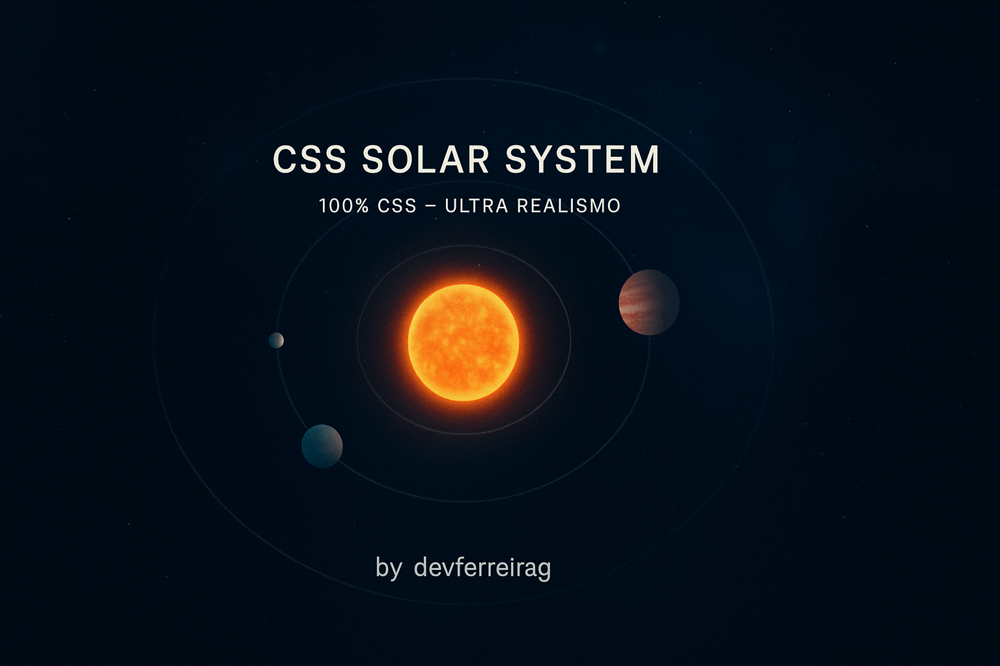

# 🌌 CSS Solar System 2025 — Ultra Realismo, 100% CSS

[](.github/workflows/ci.yml)
[](LICENSE)
[](#acessibilidade)
[](https://futurodevjunior.github.io/CSS/)

<!-- Palavras-chave para SEO -->

<!-- keywords: CSS, Sistema Solar, Acessibilidade, WCAG, Solar System, CSS Only, Planetas, Animação, Responsivo, Open Source, FuturoDevJunior -->



---

## 📑 Tabela de Conteúdos

- [Demonstração](#demonstração)
- [Por que só CSS?](#por-que-só-css)
- [Como usar](#como-usar)
- [Customização e Temas](#customização-e-temas)
- [Variáveis Customizáveis](#variaveis-customizaveis)
- [Acessibilidade](#acessibilidade)
- [Contribua](#contribua)
- [Estrutura](#estrutura)
- [🛡️ Integração Contínua (CI)](#🛡️-integração-contínua-ci)
- [Licença](#licença)
- [Créditos](#créditos)

---

## 🚀 Demonstração

- [Veja funcionando no GitHub Pages](https://futurodevjunior.github.io/CSS/)
- [Exemplo mínimo](example.html)
- [Teste de acessibilidade](test-accessibility.html)
- [Exemplo de temas](theme-dark-light-example.html)

---

## 💡 Por que só CSS?

Este projeto é um desafio de criatividade e performance: criar um sistema solar ultra realista, fluido e acessível **usando apenas CSS**. Sem JavaScript, sem dependências externas — apenas HTML e CSS puro, explorando ao máximo animações, variáveis, efeitos ópticos e responsividade.

- 100% CSS, mínimo HTML, zero JS
- Ultra realismo, fluidez, performance, acessibilidade, modularidade
- Assinatura glassmorphism

---

## 🎨 Como usar

1. Importe o `styles.css` no seu HTML.
2. Use a estrutura mínima abaixo:

```html
<main aria-label="Sistema Solar CSS">
  <div class="solar-system" aria-label="Sistema Solar animado" role="region">
    <!-- ... camadas ... -->
    <div class="planet earth" data-name="Terra" tabindex="0" aria-label="Terra"></div>
    <!-- ... outros planetas ... -->
    <div class="signature" tabindex="0" aria-label="Assinatura do autor">by <a href="#">devferreirag</a></div>
  </div>
</main>
```

Veja o [example.html](example.html) para um exemplo completo.

---

## 🛠️ Customização e Temas

- Edite variáveis em `:root` (veja tabela abaixo) para alterar tamanhos, cores, velocidades e efeitos.
- Use classes utilitárias:
  - `.blur`, `.bloom`, `.chromatic`, `.glare`, `.halo`, `.grain`, `.glass`, `.pulse`
- Exemplo de uso:

```html
<div class="planet earth bloom chromatic" data-name="Terra">
  <div class="aurora"></div>
  <div class="clouds"></div>
  <div class="storm"></div>
</div>
<div class="signature glass pulse">by <a href="#">devferreirag</a></div>
```

- Veja [theme-dark-light-example.html](theme-dark-light-example.html) para temas customizados.

### Exemplos de Temas

```css
body.custom-theme {
  --color-bg: #181818;
  --color-star: #ffecb3;
  --color-nebula1: rgba(255, 100, 0, 0.18);
  --color-bloom: rgba(255, 200, 0, 0.18);
  --color-chromatic1: #ff9800;
  --color-chromatic2: #ffd600;
  --color-tooltip-bg: #222;
  --color-tooltip-light: #ffd600;
  --color-tooltip-dark: #222;
}
```

---

## 🔧 Variáveis Customizáveis

| Variável             | Descrição                 | Valor padrão          |
| --------------------- | --------------------------- | ---------------------- |
| --color-bg            | Cor de fundo                | #070d1a                |
| --color-star          | Cor das estrelas principais | #fff                   |
| --color-nebula1       | Cor da nebulosa 1           | rgba(0,150,255,0.18)   |
| --sun-size            | Tamanho do Sol              | 120px                  |
| --earth-size          | Tamanho da Terra            | 26px                   |
| --color-bloom         | Efeito bloom global         | rgba(255,255,255,0.18) |
| --color-chromatic1    | Aberração cromática 1    | #00ffe0                |
| --color-chromatic2    | Aberração cromática 2    | #ff00cc                |
| --color-tooltip-bg    | Fundo do tooltip            | #222                   |
| --color-tooltip-light | Cor do texto do tooltip     | #fff                   |
| --z-signature         | Z-index da assinatura       | 1000                   |
| ...                   | ...                         | ...                    |

Veja `_variables.css` para a lista completa.

---

## ♿ Acessibilidade

- Foco visível customizado em todos elementos interativos.
- Contraste reforçado para tooltips e assinatura (WCAG AA).
- Tooltips acessíveis por teclado.
- Suporte a `prefers-reduced-motion` e modo daltônico.
- Teste manual: [test-accessibility.html](test-accessibility.html)
- Relatórios automáticos de acessibilidade são gerados via [pa11y](https://pa11y.org/) no CI e anexados aos Pull Requests.

**Como testar acessibilidade:**

- Navegue com TAB para testar foco visível em planetas e assinatura.
- Passe o mouse e use TAB para ver tooltips acessíveis.
- Ative prefers-reduced-motion no sistema e recarregue.
- Ative modo daltônico/alto contraste no sistema.
- Verifique contraste de tooltips e assinatura.

**Conformidade:**

- O projeto segue as recomendações WCAG 2.1 AA para contraste, navegação por teclado e foco visível.
- Testes automáticos e manuais garantem acessibilidade contínua.

---

## 🤝 Contribua

1. Faça um fork do projeto
2. Crie uma branch: `git checkout -b minha-feature`
3. Faça suas alterações e commit: `git commit -m 'Minha contribuição'`
4. Envie para seu fork: `git push origin minha-feature`
5. Abra um Pull Request

Sugestões, PRs e colaborações são muito bem-vindos!

---

## ☕ Apoie este projeto

Se este projeto te ajudou ou inspirou, considere apoiar meu trabalho:

[](https://buymeacoffee.com/devferreirag)

---

## 📂 Estrutura

```
CSS/
├── styles.css
├── _variables.css
├── _reset.css
├── _utilities.css
├── _background.css
├── _planets.css
├── _signature.css
├── index.html
├── example.html
├── test-accessibility.html
├── theme-dark-light-example.html
├── README.md
├── LICENSE
└── .github/
    └── ISSUE_TEMPLATE/
        ├── bug_report.md
        └── feature_request.md
    └── PULL_REQUEST_TEMPLATE.md
    └── workflows/
        └── ci.yml
```

---

## 🛡️ Integração Contínua (CI)

Este projeto executa automaticamente:

- **Lint CSS** com [stylelint](https://stylelint.io/)
- **Validação de acessibilidade** com [pa11y](https://pa11y.org/)

A cada push ou pull request, o código é verificado para garantir qualidade e acessibilidade.

Se tiver sugestões para melhorar o processo de CI ou automações, abra uma issue ou PR!

---

## 📝 Licença

MIT. Sinta-se livre para usar, modificar e contribuir!

---

## 🙏 Créditos

- [Gabriel Ferreira](https://linkedin.com/in/devferreirag) (autor)
- Comunidade open sourcegit

---

> **Feito com paixão por CSS, acessibilidade e criatividade.  
> Veja funcionando em [futurodevjunior.github.io/CSS/](https://futurodevjunior.github.io/CSS/)!**
